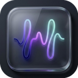

<p align="center">
  
</p>

<h1 align="center">Unitone</h1>

<p align="center">
  <strong>すべてのチャットアプリを1つに</strong>
</p>

<p align="center">
  <a href="https://github.com/shngmsw/Unitone/releases/latest">
    
  </a>
  <a href="https://github.com/shngmsw/Unitone/blob/main/LICENSE">
    
  </a>
  <a href="https://github.com/shngmsw/Unitone/releases">
    
  </a>
</p>

<p align="center">
  <a href="README.md">🇺🇸 English</a>
</p>

<p align="center">
  <a href="#機能">機能</a> •
  <a href="#対応サービス">対応サービス</a> •
  <a href="#インストール">インストール</a> •
  <a href="#使い方">使い方</a> •
  <a href="#開発">開発</a> •
  <a href="#コントリビューション">コントリビューション</a>
</p>

---

## 概要

Unitoneは、Slack、Google Chat、Microsoft Teams、Chatworkなど、複数のチャットサービスを1つのウィンドウで管理できるデスクトップアプリケーションです。アプリやブラウザタブの切り替えはもう不要。集中して作業を進められます。

<!--
スクリーンショットのプレースホルダー
<p align="center">
  
</p>
-->

## 機能

- **マルチサービス対応** - Slack、Google Chat、Teams、Chatworkなどを1つのウィンドウで
- **カスタムサービス追加** - 任意のWebベースチャットサービスをURLで追加可能
- **ドラッグ&ドロップで並べ替え** - サービスの順序を自由にカスタマイズ
- **AIコンパニオン** - Gemini、Claude、ChatGPTなどのAIアシスタントパネルを内蔵
- **通知バッジ** - 各サービスの未読数を一目で確認
- **システムトレイ** - バックグラウンドで常駐、いつでもアクセス可能
- **自動更新** - 新しいバージョンを自動でチェック・インストール
- **クロスプラットフォーム** - macOS、Windows、Linuxに対応

## 対応サービス

| サービス | URL |
|---------|-----|
| Slack | https://app.slack.com |
| Google Chat | https://chat.google.com |
| Microsoft Teams | https://teams.microsoft.com |
| Chatwork | https://www.chatwork.com |
| Discord | https://discord.com/app |
| *その他Webチャット* | カスタムURL |

## インストール

### ダウンロード

[GitHub Releases](https://github.com/shngmsw/Unitone/releases/latest) から、お使いのプラットフォーム向けの最新版をダウンロードしてください。

| プラットフォーム | ダウンロードファイル |
|----------------|---------------------|
| **Windows** | `Unitone-Setup-x.x.x.exe`（インストーラー）または `Unitone-x.x.x-portable.exe`（ポータブル版） |
| **macOS (Intel)** | `Unitone-x.x.x-x64.dmg` |
| **macOS (Apple Silicon)** | `Unitone-x.x.x-arm64.dmg` |
| **Linux** | `Unitone-x.x.x.AppImage`、`.deb`、`.rpm` |

### コード署名に関する重要なお知らせ

> ⚠️ **Windows をお使いの方へ**
>
> Unitoneは現在、コード署名証明書なしで配布されています。そのため、**初回起動時にWindowsの警告画面が表示されます**。
>
> **警告の対処方法：**
> 1. 「Windows によって PC が保護されました」という青い画面が表示されます
> 2. **「詳細情報」** をクリックします
> 3. **「実行」** ボタンをクリックします
>
> これは無料のオープンソースプロジェクトのためのコスト削減措置です。ソースコードはすべて公開されており、安全性を確認いただけます。

> ⚠️ **macOS をお使いの方へ**
>
> 現在、macOS版は**署名・公証（Notarization）未対応**のため、正常に動作しない場合があります。
>
> **現在の状況：**
> - Apple Developer Program への登録が必要なため、署名取得を準備中です
> - 署名取得後に正式対応予定です
>
> **暫定的な対処方法（上級者向け）：**
> 1. 「開発元を検証できないため開けません」という警告が表示されます
> 2. アプリを右クリック →「開く」→「開く」をクリック
> 3. または、システム環境設定 → セキュリティとプライバシー →「このまま開く」をクリック
>
> ※ この方法でも動作しない場合があります。正式対応までお待ちください。

> ✅ **Linux をお使いの方へ**
>
> 追加の手順は不要です。そのままご利用いただけます。

## 使い方

### 基本操作

1. **起動** - アプリケーションフォルダ（macOS）またはスタートメニュー（Windows）からUnitoneを起動
2. **サービスを追加** - サイドバーの `+` ボタンをクリックして新しいチャットサービスを追加
3. **サービスを切り替え** - サイドバーのサービスアイコンをクリックして切り替え
4. **並べ替え** - サービスアイコンをドラッグ&ドロップで並べ替え
5. **AIコンパニオン** - 「AI」ボタンをクリックしてAIアシスタントパネルを表示/非表示
6. **設定** - 歯車アイコンをクリックしてサービスを管理

### キーボードショートカット

| 操作 | ショートカット |
|------|---------------|
| AIパネルの切り替え | `Ctrl/Cmd + Shift + A` |
| 現在のサービスを再読み込み | `Ctrl/Cmd + R` |
| 終了 | `Ctrl/Cmd + Q` |

## 開発

### 必要な環境

- Node.js 18以上
- npm

### セットアップ

```bash
# リポジトリをクローン
git clone https://github.com/shngmsw/Unitone.git
cd Unitone

# 依存関係をインストール
npm install

# 開発モードで起動
npm run dev
```

### ビルド

```bash
# 現在のプラットフォーム向けにビルド
npm run build

# プラットフォーム別ビルド
npm run build:mac    # macOS
npm run build:win    # Windows
npm run build:linux  # Linux

# 全プラットフォーム向けビルド
npm run build:all
```

### プロジェクト構成

```
Unitone/
├── assets/           # アイコンなどのリソース
│   ├── icons/        # アプリアイコン（各サイズ）
│   └── mac/          # macOS用エンタイトルメント
├── scripts/          # ビルドスクリプト
├── src/
│   ├── main/         # Electronメインプロセス
│   ├── preload/      # プリロードスクリプト（IPCブリッジ）
│   └── renderer/     # レンダラープロセス（UI）
├── docs/             # ドキュメント
└── package.json
```

## コントリビューション

コントリビューションを歓迎します！以下の手順でご参加ください。

1. リポジトリを **Fork** する
2. フィーチャーブランチを作成（`git checkout -b feature/amazing-feature`）
3. 変更をコミット（`git commit -m 'Add amazing feature'`）
4. ブランチにプッシュ（`git push origin feature/amazing-feature`）
5. **Pull Request** を作成

### ガイドライン

- 既存のコードスタイルに従う
- 明確なコミットメッセージを書く
- 提出前にご自身のプラットフォームでテストする
- 必要に応じてドキュメントを更新する

## ライセンス

このプロジェクトはMITライセンスの下で公開されています。詳細は [LICENSE](LICENSE) ファイルをご覧ください。

## 謝辞

- [Electron](https://www.electronjs.org/) で構築
- 自動更新は [electron-updater](https://www.electron.build/auto-update) を使用

---

<p align="center">
  Made with ❤️ by <a href="https://github.com/shngmsw">shngmsw</a>
</p>
